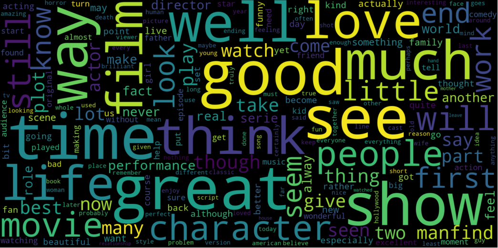

# Natural-Language-Processing-IMDB-dataset

Various Machine learning models were implemented to classify textual data. The input is text documents and the output is categorical variable (class labels). All the machine learning models were implemented using Scikit learn libraries. The dataset used here in this project is IMDB dataset.

# Dataset Information

This is a dataset for binary sentiment classification containing substantially more data than previous benchmark datasets. Set of 25,000 highly polar movie reviews for training, and 25,000 for testing are provided. There is additional unlabeled data for use as well. Raw text and already processed bag of words formats are provided. [Dataset](https://ai.stanford.edu/~amaas/data/sentiment/)

# Word cloud

